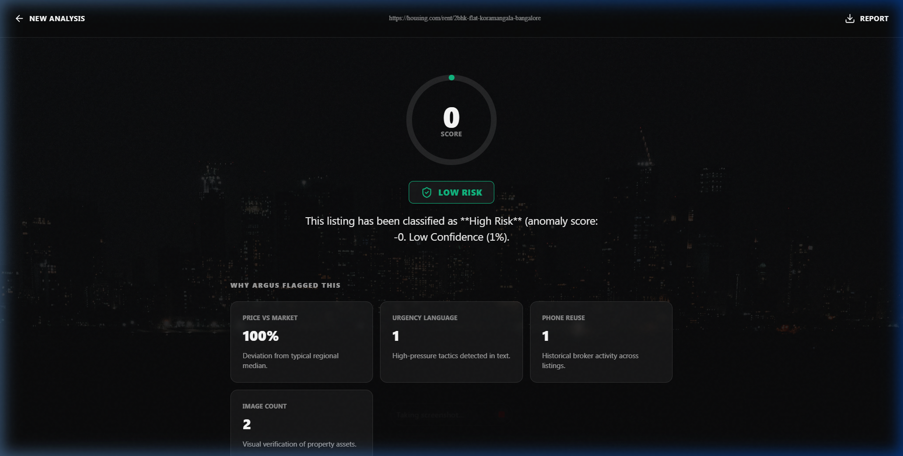

# 🛡️ Project Argus

**AI-Powered Rental Scam Detection for Indian Cities**

Project Argus is an AI-powered system that analyzes rental listings to detect suspicious patterns and potential scams. By combining anomaly detection with multi-signal forensic analysis, Argus evaluates pricing behavior, listing signals, and broker activity to help renters identify risky listings across major Indian cities.


## 📸 Preview




## 🚀 High-Level Workflow

1.  **User Submission**: User submits a listing URL from popular Indian rental platforms.
2.  **Signal Extraction**: Argus scrapes and extracts listing signals (price, description, images, contact info).
3.  **Anomaly Detection**: A trained **IsolationForest (scikit-learn)** model evaluates listing features against market benchmarks.
4.  **AI Explanation**: An AI reasoning layer (via **OpenRouter**) generates a detailed forensic explanation of the findings.
5.  **Dashboard Presentation**: The system presents a final risk verdict, forensic insights, and safety recommendations.

## 🏗️ System Architecture

Project Argus is designed with a modular, pipeline-oriented architecture:

-   **Scraper Layer**: Intelligent extraction of data from listings (99acres, Housing.com, NoBroker).
-   **Feature Engineering Pipeline**: Normalizes raw data and computes key metrics like price-per-sqft and urgency scores.
-   **ML Detection Model**: Utilizes an **IsolationForest (scikit-learn)** algorithm for robust unsupervised anomaly detection.
-   **AI Explanation Layer**: Synthesizes forensic signals into human-readable intuition using the **OpenRouter API** (Claude/GPT).
-   **Backend API Service**: A performant **FastAPI** service handling orchestration and analysis requests.
-   **Frontend Dashboard**: A premium **React** application built with GSAP and Framer Motion for cinematic visualizations.

## 📂 Project Structure

```text
project-argus/
├── backend/            # FastAPI service & orchestration
│   ├── ai_layer/       # ML models (IsolationForest) & logic
│   ├── scrapers/       # Intelligent platform scrapers
│   └── services/       # Core forensic service logic
├── frontend/           # React + Tailwind + GSAP dashboard
│   ├── src/            # Components, assets & main logic
│   └── public/         # Static assets & backgrounds
├── architecture.md     # Detailed system architecture
└── requirements.md     # Functional & technical specs
```

## ⚙️ Tech Stack

### Backend
- **FastAPI**: High-performance Python API framework.
- **Python**: Core logic and data processing.
- **scikit-learn**: ML pipeline using the IsolationForest algorithm.

### AI Layer
- **OpenRouter API**: LLM reasoning for forensic explanations.

### Frontend
- **React**: Modern component-based UI.
- **Tailwind CSS**: Utility-first styling.
- **GSAP / Framer Motion**: Cinematic animations and transitions.

### Infrastructure
- **Playwright**: Intelligent scraping for dynamic content.

## ✨ User Experience Flow

Argus provides a "cinematic" and intentional analysis experience:

1.  **Landing Page**: A clean, high-impact entry point for URL submission.
2.  **Analysis Transition**: A full-screen sequential loading animation that visually represents the forensic steps:
    -   *Extracting listing data*
    -   *Running anomaly detection*
    -   *Cross-checking broker activity*
    -   *Generating AI explanation*
3.  **Results Dashboard**: A comprehensive breakdown of the results.

## 📊 Results Dashboard Sections

The dashboard is structured into four forensic layers:

-   **Argus Verdict Hero**: Displays the normalized **Risk Score** (0-100) and the primary **Risk Verdict** (Low Risk, Suspicious, or High Risk).
-   **Signal Grid**: A breakdown of the core forensic signals:
    -   **Price vs Market**: Comparison against regional medians.
    -   **Urgency Language**: Detects high-pressure sales tactics.
    -   **Phone Reuse**: Identifies mass-listing broker activity.
    -   **Image Count**: Measures listing completeness.
-   **AI Forensic Explanation**: A narrative reasoning generated by the AI model, explaining the "why" behind the score.
-   **Protective Recommendations**: Actionable safety guidance tailored to the detected risk level.

## 🛠️ Final Polish Pass

The system has undergone a rigorous final stabilization phase:
-   **Debug Purge**: All debug logging (`print`, `console.log`) has been stripped for production.
-   **Response Normalization**: API schemas are strictly standardized across all endpoints.
-   **Code Sanitization**: Legacy experimental scripts and unused components were removed.
-   **Unified Logic**: Score calculations are synchronized between the ML pipeline and UI gauge.
-   **Visual Branding**: Consistent "Night City" visual styling across all screens.

## 🚀 Running the System

### Prerequisites
- Python 3.11+
- Node.js 18+

### 1. Start the Backend
```bash
cd backend
pip install -r requirements.txt
python -m uvicorn main:app --host 127.0.0.1 --port 8000 --reload
```

### 2. Start the Frontend
```bash
cd frontend
npm install
npm run dev
```

### 3. Analyze a Listing
1. Open the frontend at `http://localhost:3000`.
2. Scroll to the "Verify a Listing" section.
3. Paste a listing URL and click **Verify Now**.

---

**🛡️ Protect India's Renters** | Built for social impact and security.
