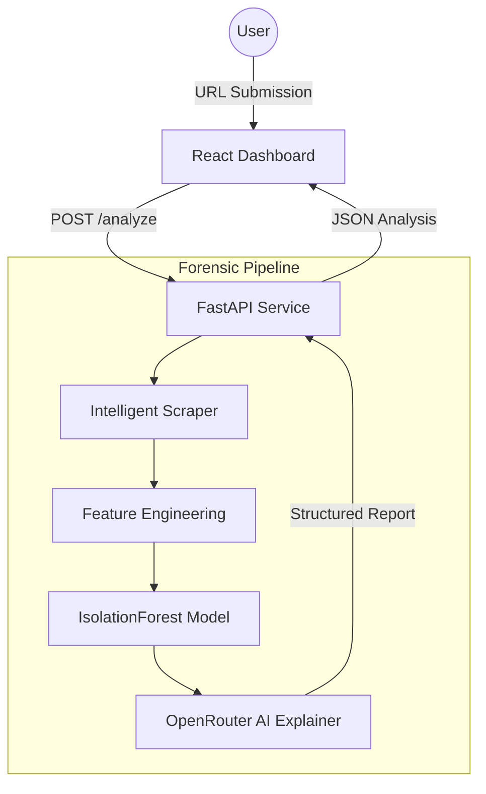

# 🏗️ System Architecture: Project Argus

Project Argus is an AI-driven forensic system designed to identify rental scams through multi-signal anomaly detection. This document details the architectural layers and data flow of the final implementation.

## 1. High-Level Architecture

The system follows a modular pipeline architecture, separating data acquisition, forensic analysis, and user presentation.

## 2. Core Architectural Layers

### 2.1 Scraper Layer
The **Scraper Layer** is responsible for resilient data extraction from various Indian rental platforms (99acres, Housing.com, NoBroker). It handles:
- Dynamic content rendering via Playwright (where necessary).
- HTML parsing and metadata extraction.
- Resilient fallback mechanisms for varying DOM structures.

### 2.2 Feature Engineering Pipeline
Raw listing data is transformed into forensic features:
- **Price Metric**: Normalization of rental prices against regional medians to calculate deviation.
- **Urgency Scoring**: NLP-based detection of high-pressure sales keywords.
- **Broker Behavioral Analysis**: Identifying patterns like phone number reuse across multiple disparate listings.
- **Listing Completeness**: Evaluating the quality and quantity of listing metadata and images.

### 2.3 ML Detection Model (IsolationForest)
The heart of the detection logic is an **IsolationForest** model. Unlike supervised models that require labeled scam datasets, IsolationForest identifies "outliers" based on the features defined above.
- **Logic**: It isolates anomalies (scams) by randomly selecting a feature and a split value. Outliers are isolated in fewer steps than normal points.
- **Output**: A normalized risk score (0-100) where higher values indicate higher deviation from "normal" (legitimate) behavior.

### 2.4 AI Explanation Layer (OpenRouter)
To ensure the system is "Explainable AI" (XAI), the results are passed to an LLM reasoning engine via **OpenRouter**:
- **Inputs**: Raw signals + ML risk score.
- **Task**: Synthesize the "why" behind the verdict into a human-readable forensic report.
- **Benefit**: Provides intuition to the user, such as *"The price is 40% below market, which combined with high-urgency language, strongly suggests a phantom listing scam."*

### 2.5 Backend API Service
A **FastAPI** application serves as the central orchestrator:
- Manages the lifecycle of an analysis request.
- Handles concurrent analysis tasks.
- Standardizes the response schema for the frontend.

### 2.6 Frontend Analysis Dashboard
A premium **React** application built for clarity and impact:
- **GSAP Animations**: Used for the cinematic loading sequence that builds user trust in the analysis process.
- **Framer Motion**: Smooth transitions and interactive elements.
- **Modular Components**: Reusable UI blocks for signals, forensic reasoning, and recommendations.

## 3. Data Flow

1.  **Request**: User submits listing URL.
2.  **Extraction**: Scraper identifies the platform and extracts raw text/prices.
3.  **Benchmark Look-up**: The system compares extracted prices against a local/cached database of regional market medians.
4.  **Anomaly Scoring**: Features are fed into the IsolationForest model to determine the statistical "riskiness."
5.  **Reasoning**: Signals are passed to the AI layer for narrative generation.
6.  **Response**: A unified JSON payload is returned to the frontend.

## 4. Security & Cleanup
- **No PII Storage**: The system is designed for stateless analysis; listing data is processed in-memory.
- **Optimized Performance**: Multi-threaded analysis ensures a <10s response time despite the complex pipeline.
- **Code Health**: Final production pass stripped all debug logic and standardized API response formats.
